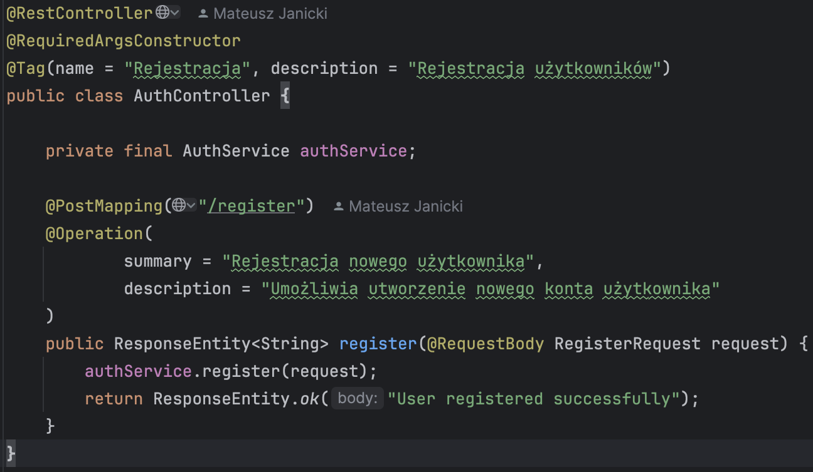
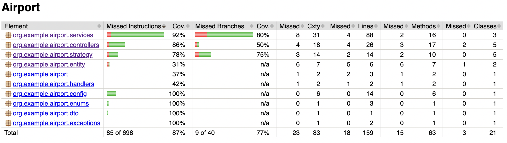

# Airport App ✈️

## Opis projektu

Aplikacja webowa typu backend-only, pozwalająca na:

- Rejestrację użytkowników z rolą `ROLE_USER` lub `ROLE_ADMIN`
- Zarządzanie lotami przez administratora
- Zapisywanie się na loty przez użytkowników
- Aktualizację bagażu, przegląd historii lotów
- Generowanie raportów lotów
- Zabezpieczenie endpointów przy pomocy Spring Security
- Zarządzanie danymi przez bazę PostgreSQL i migracje Flyway
- Pokrycie testami jednostkowymi + Jacoco
- Dokumentację REST API w Swagger UI

---

## Wzorzec projektowy Strategy

Działanie
- Użytkownik podczas rejestracji wybiera klasę podróży: ECONOMY lub BUSINESS.
- Na tej podstawie przypisywana jest odpowiednia strategia:
- EconomyBaggageStrategy – ścisłe sprawdzanie limitu.
- BusinessBaggageStrategy – dozwolone przekroczenie limitu o 10 kg.

Implementacja
- Interfejs: BaggageCheckStrategy
- Implementacje:
- EconomyBaggageStrategy – userBaggage <= flightLimit
- BusinessBaggageStrategy – userBaggage <= flightLimit + 10
- Strategia jest dynamicznie wybierana na podstawie pola travelClass z obiektu User.

---

## Polimorfizm w aplikacji

W aplikacji zastosowano polimorfizm dynamiczny w celu elastycznego zarządzania logiką
walidacji bagażu w zależności od klasy podróży (ekonomiczna, biznesowa).
Zamiast tworzyć rozbudowane instrukcje warunkowe, wykorzystano wspólny interfejs
i różne implementacje strategii, które są wybierane w czasie działania programu.
Pozwala to serwisowi rejestracji użytkownika działać niezależnie od konkretnej klasy
— wystarczy, że odwołuje się do wspólnego typu. Dzięki temu kod jest czytelniejszy,
łatwiejszy w rozbudowie i zgodny z zasadami programowania obiektowego.

---

## Technologia

- Java 17
- Spring Boot 3
- Spring Security
- PostgreSQL (Docker)
- Flyway
- JUnit + Mockito + Jacoco
- Swagger UI (OpenAPI)
- Lombok

---

## Opis

1. Docker:

2. Struktura projektu:

3. Spring Security:

4. REST Controller:

5. Entity:

User:

Flight:

6. Swagger UI:

7. Diagram ERD:

8. Flyway:

9. Testy (JUnit i JACOCO):

